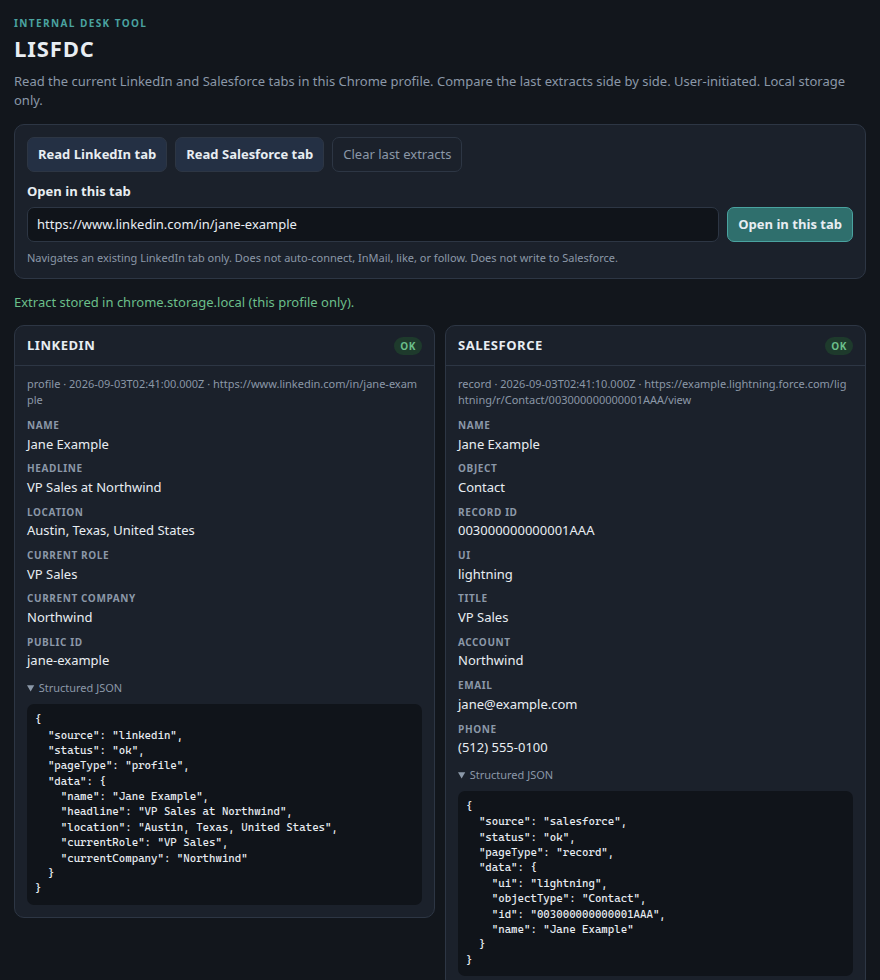
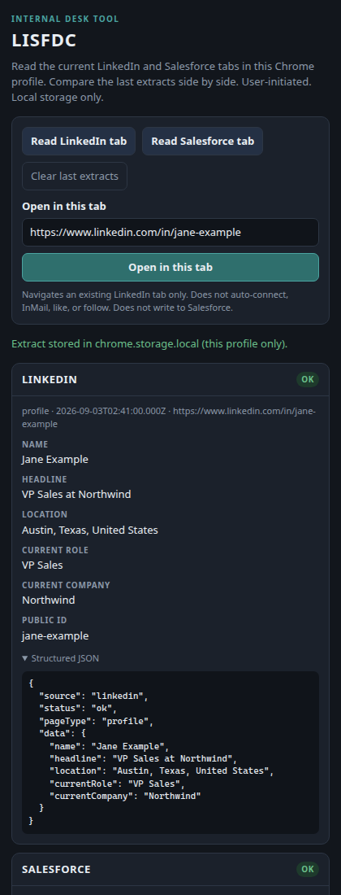
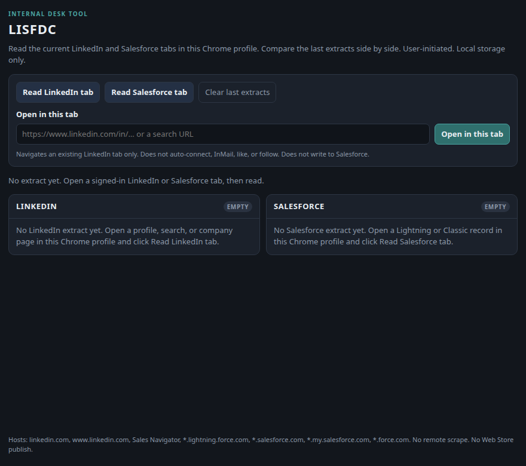
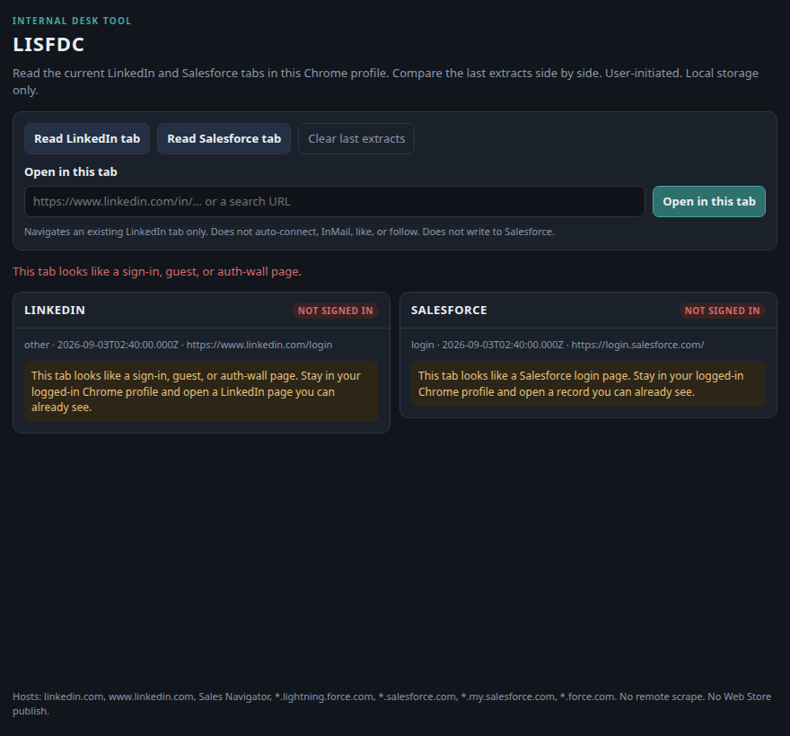

# LISFDC

LISFDC is a **Chrome Manifest V3** extension that reads the **current** LinkedIn tab and the **current** Salesforce tab from the user’s **already-logged-in Chrome profile**, then shows the last extract of each **side by side** in a side panel.

It is an internal desk tool. It is not a scraper farm, not a session-replay box, and not a Chrome Web Store product.

**Repo:** [jasoaco79/LISFDC](https://github.com/jasoaco79/LISFDC)

---

## What v1 does

The toolbar action opens a **side panel** (not only a popup) with three user-initiated controls:

1. **Read LinkedIn tab** — a content script on `linkedin.com` / `www.linkedin.com` / `*.linkedin.com` (including Sales Navigator under `/sales/`) reads the page you already have open:
   - profile (`/in/…`, Sales Navigator people)
   - search result cards (capped; current page only)
   - company page
   - structured JSON plus a short field view in the panel
2. **Read Salesforce tab** — a content script on `*.lightning.force.com`, `*.salesforce.com`, `*.my.salesforce.com`, and `*.force.com` reads the Lightning or Classic **record already on screen**:
   - record **Id from the URL**
   - object type from the URL path or the Id key prefix
   - visible name / header fields (SLDS header, highlights items, Classic label/data columns)
   - **no Salesforce writes**
3. **Open in this tab** — you type a LinkedIn profile or search URL; LISFDC navigates an **existing LinkedIn tab** in this Chrome profile to that URL. That is the only allowed “control.” It does **not** auto-connect, InMail, like, or follow.

Last extracts are stored in **`chrome.storage.local` only** (this browser profile). Nothing is posted to a server.

### Side-by-side compare

After you read both tabs, the panel keeps **last LinkedIn extract** and **last Salesforce extract** next to each other so you can compare a person/company with a CRM record.



Narrow side-panel width (typical Chrome side panel):



Empty state, before any read:



Not signed in / unexpected login layout (reader must not crash):



These screenshots are of the **built side panel UI** (`src/panel/panel.css` plus the static renders in `fixtures/panel-*.html`). Live tabs use the same layout once you click the read buttons. The fixture people and accounts are invented.

---

## What this is not

- Not a datacenter scraper, Puppeteer farm, or proxy.
- Not a background worker that `fetch`es LinkedIn or Salesforce from a cloud IP.
- Not a cookie / SID / `Authorization` exporter.
- Not a session-replay tool. Do not copy this profile’s cookies onto another machine.
- Not an auto-harvester: no `chrome.alarms` crawl, no mass search scrape, no rate-unlimited walker.
- Not published to the Chrome Web Store. **Unpacked local install only.**
- Not a LinkedIn or Salesforce branded client. The UI only names the sites.

---

## Load unpacked (required)

Use a **desktop Chrome profile that is already signed in** to LinkedIn and Salesforce. That residential/browser session is the point of LISFDC.

1. Clone this repo onto the machine that has that Chrome profile.
2. Open Chrome and go to **`chrome://extensions`**.
3. Turn on **Developer mode** (top right).
4. Click **Load unpacked**.
5. Select the **repository root** (the folder that contains `manifest.json`).
6. Confirm LISFDC appears with Manifest version **3**.
7. Click the puzzle-piece extensions menu → pin **LISFDC** if you want.
8. Click the LISFDC icon. Chrome opens the **side panel**.
9. In that same Chrome profile, open:
   - a LinkedIn profile, search, or company page you can already see
   - a Salesforce Lightning or Classic record you can already see
10. In the side panel, click **Read LinkedIn tab** and **Read Salesforce tab**.

If a read says the content script is missing, **refresh** the LinkedIn or Salesforce tab (the reader is injected on load) and click read again.

### First-run permission grant

Chrome will ask for host access to LinkedIn and Salesforce when you load the extension or first use those tabs. Accept only if you intend to read those tabs from this profile. There is no `<all_urls>` permission.

### Requirements

- Google Chrome **114+** (Side Panel API).
- The extension folder must stay on disk; unpacked extensions load from that path.

---

## Daily use

| Control | What it does | What it will not do |
| --- | --- | --- |
| Read LinkedIn tab | Parse the visible LinkedIn / Sales Navigator document | Connect, InMail, like, follow, or page through search automatically |
| Read Salesforce tab | Parse the visible Lightning/Classic record | Create, update, or delete CRM data |
| Open in this tab | `chrome.tabs.update` on an existing LinkedIn tab | Open random hosts, `javascript:` URLs, or create a new tab |
| Clear last extracts | Remove `lastLinkedIn` / `lastSalesforce` from `chrome.storage.local` | Touch cookies or site storage |

Typed navigation accepts only `https` URLs on LinkedIn hosts (bare `www.linkedin.com/in/…` is fine; `https://` is added). Usernames/passwords in the URL are rejected.

---

## Architecture (v1)

```
manifest.json                 MV3, side_panel, host-limited content_scripts
src/background.js             Service worker: route messages, store extracts, navigate
src/hosts.js                  LinkedIn / Salesforce host allowlists
src/shared/sanitize.js        Redact cookies / SIDs / tokens before storage
src/shared/dom.js             Resilient text helpers
src/panel/                    Side panel UI
src/content/linkedin.js       In-page listener (LinkedIn origins only)
src/content/parse-linkedin.js Profile / search / company reader
src/content/salesforce.js     In-page listener (Salesforce origins only)
src/content/parse-salesforce.js URL Id + visible header reader
```

**All LinkedIn and Salesforce network stays in those tabs.** The service worker does not `fetch` those origins. It only:

- talks to the content script already running in the tab
- updates an existing LinkedIn tab URL the user typed
- writes the structured extract to `chrome.storage.local`

LinkedIn’s DOM is brittle. The reader uses several selectors plus JSON-LD / title fallbacks. If the page is a login/guest/auth-wall, status is **`not_signed_in`**. If the page is signed-in but the expected fields are gone, status is **`unexpected_layout`**. The side panel will not crash.

Salesforce Lightning hashes many CSS class names. The reader prefers:

1. record Id and object from the URL (`/lightning/r/Contact/003…/view` or Classic `/003…`)
2. visible header / highlights / Classic label columns
3. `document.title` (`Name \| Object \| Salesforce`)

It does **not** key off hashed `.cXyz` tokens.

---

## Host permissions (complete list)

There is **no** `<all_urls>`.

- `https://linkedin.com/*`
- `https://www.linkedin.com/*`
- `https://*.linkedin.com/*`
- `https://*.lightning.force.com/*`
- `https://*.salesforce.com/*`
- `https://*.my.salesforce.com/*`
- `https://*.force.com/*`
- `https://salesforce.com/*`

Permissions: `sidePanel`, `storage`, `tabs`.

---

## Storage

`chrome.storage.local` keys:

- `lastLinkedIn` — last LinkedIn extract object
- `lastSalesforce` — last Salesforce extract object

Each extract looks like:

```json
{
  "source": "linkedin",
  "status": "ok",
  "pageType": "profile",
  "url": "https://www.linkedin.com/in/…",
  "extractedAt": "2026-09-03T02:41:00.000Z",
  "data": { "name": "…", "headline": "…", "location": "…", "currentRole": "…", "currentCompany": "…" },
  "warnings": []
}
```

Before write, values that look like cookies, `sid=`, `li_at`, Bearer tokens, or other session blobs are replaced with `[redacted]`.

---

## Secrets that must stay out of git

Never commit:

- LinkedIn or Salesforce passwords
- `li_at`, `JSESSIONID`, Salesforce `sid`, `Authorization` headers
- exported cookie jars, HAR files with cookies, session JSON
- API keys (this repo does not need any)
- `.pem` / unpacked-extension private keys if you ever pack a `.crx` (you should not)

`.gitignore` already blocks common dump names. If a secret lands in git history, rotate it; do not “clean” a live session token and keep using it.

---

## Verify locally (no live LinkedIn/Salesforce required)

From the repo root (dev dependency: `linkedom`, used only by tests):

```bash
npm install
python3 scripts/make-icons.py   # already committed under icons/
npm test                        # host allowlist + fixture DOM parsers
```

The parser harness loads the HTML fixtures in `fixtures/` and asserts the readers are not stubs:

- LinkedIn profile → name, headline, location, current role/company
- LinkedIn search → visible cards
- LinkedIn company → company name
- LinkedIn guest/login → `not_signed_in`
- Salesforce Lightning → Id, Contact, name, header fields; **no `sid=` in the extract**
- Salesforce Classic → Id from `/003…`, name from the page header
- Salesforce login → `not_signed_in`

Open `src/panel/panel.html` in Chrome to inspect the side panel UI without loading the extension (`?preview=empty` and `?preview=unsigned` are extra states).

---

## Install reminder (short)

`chrome://extensions` → Developer mode → **Load unpacked** → select this folder → click the LISFDC icon → use the side panel on your real LinkedIn and Salesforce tabs.

---

## Publishing and merge

- **Do not publish to the Chrome Web Store.**
- **Do not deploy** this to a server.
- Pull requests stay **off `main`** until **Jason says yes to merge**. Draft PRs are the default. Do not merge on your own.

See [HANDOFF.md](HANDOFF.md) for leftover work and the same merge rule.
